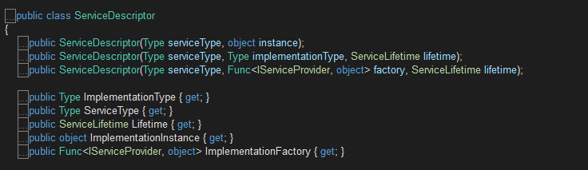
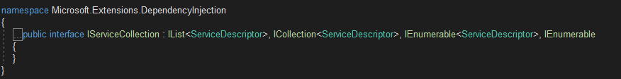
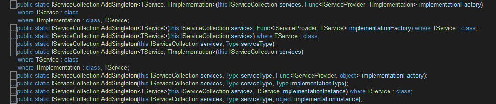

# Asp.Net Core DI-服务注册

包含服务注册信息的IServiceCollection对象最终被用来创建作为DI容器的IServiceProvider对象。服务注册就是创建出现相应的ServiceDescriptor对象并将其添加到指定IServiceCollection集合对象中的过程。IServiceCollection实际上是包含了**ServiceDescriptor**对象的集合.

## ServiceDescriptor

IServiceCollection对象是一个存放服务注册信息的集合.在IServiceCollection/IServiceProvider为核心的DI框架中,与之对应的类型为ServiceDescriptor.

DI框架将服务注册存储在一个通过IServiceCollection接口表示的集合之中.如下面的代码片段所示，一个IServiceCollection对象本质上就是一个元素类型为ServiceDescriptor的列表.在默认情况下我们使用的是实现该接口的ServiceCollection类型.

ServiceDescriptor共有5个属性,3个构造函数,如下所示:

属性说明:
* ServiceType:注册的服务类型.往往是一个接口
* ImplementationType:实现ServiceType接口的类
* ImplementationInstance:已经实例化的对象
* ImplementationFactory:提供对象的工厂方法.类型为Func<IServiceProvider,object>
* Lifetime:生命周期,枚举类型,对应有三个值,分别为:Singleton,Scoped,Transient

构造函数说明:
ServiceDescriptor的三个属性(ImplementationType,ImplementationInstance,ImplementationFactory)体现了服务实例的三种提供方式，并对应着三个构造函数。
* ServiceDescriptor(Type serviceType,object instace):提供现有对象,该对象就是最终提供的服务实例.
* ServiceDescriptor(Type serviceType,Type implementationType,ServiceLifetime lifetime):最终的服务实例将通过调用定义在实现类型中某一个构造函数来创建.
* ServiceDescriptor(Type serviceType, Func<IServiceProvider, object> factory, ServiceLifetime lifetime):IServiceProvider对象将会将自身作为输入参数调用该委托对象来提供服务实例

## IServiceCollection
DI框架将服务注册(IServiceDescriptor)存储在一个通过IServiceCollection接口表示的集合之中.一个IServiceCollection对象本质上就是一个元素类型为ServiceDescriptor的列表.在默认情况下我们使用的是实现该接口的ServiceCollection类型.

我们在应用启动的时候所做的服务注册就是创建出现相应的ServiceDescriptor对象并将其添加到指定IServiceCollection集合对象中的过程.考虑到服务注册是一个高频调用的操作,所以DI框架为IServiceCollection接口定义了一系列扩展方法完成服务注册的工作.

DI框架还针对具体生命周期模式为IServiceCollection接口定义了一系列的扩展方法，它们会根据提供的输入创建出对应的ServiceDescriptor对象并将其添加到指定的IServiceCollection对象中.如下所示的是针对Singleton模式的AddSingleton方法重载的定义,针对其他两个生命周期模式的AddScoped和AddTransient方法具有类似的定义.

