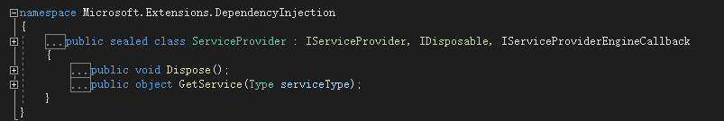
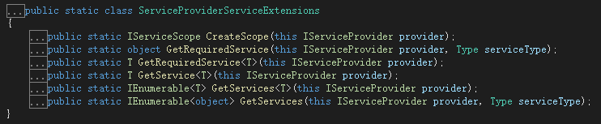
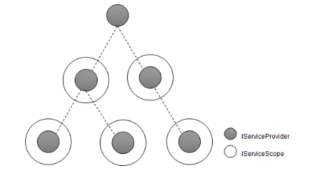
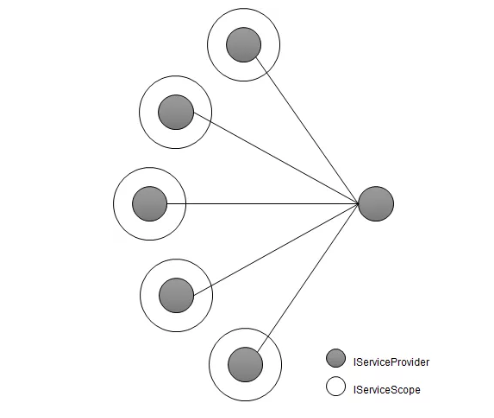
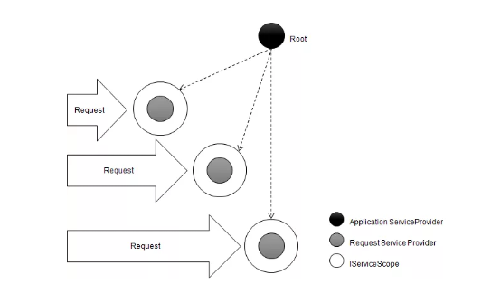

# Asp.Net Core DI-服务消费
本系列博客均来源于大内老A关于Asp.NET Core的解读,在此进基础上进行了提炼,方便日后查看学习.
包含服务注册信息的IServiceCollection对象最终被用来创建作为DI容器的IServiceProvider对象。当需要消费某个服务实例的时候，我们只需要指定服务类型调用IServiceProvider的GetService方法，IServiceProvider就会根据对应的服务注册提供所需的服务实例。

## IServiceProvider
IServiceProvider由ServiceCollection的BuildServiceProvider方法来生成,ServiceProvider只包含一个方法GetService(Type serviceType).如下图:

IserviceProvider包含其他一些扩展方法,可以方便通过不同方式不用应用场景返回实例.如下图:

* GetService<T>(this IServiceProvider provider):通过提供泛型类型T,返回对应实例,如果没有T对应的注册信息,返回null
* GetServices<T>(this IServiceProvider provider):通过提供泛型类型T,返回对应的多个实例
*  GetServices(this IServiceProvider provider, Type serviceType):传参的方式
* GetRequiredService(this IServiceProvider provider, Type serviceType):如果指定服务类型的服务注册不存在,则会抛出一个InvalidOperationException类型的异常。如果所需的服务实例是必需的，我们一般会调用者两个扩展方法

## 构造函数的选择

如果IServiceProvider对象试图通过调用构造函数的方式来创建服务实例，传入构造函数的所有参数必须先被初始化，最终被选择出来的构造函数必须具备一个基本的条件：
* 第一个原则:**IServiceProvider能够提供构造函数的所有参数**.
* 第二个原则: **每一个候选构造函数的参数类型集合都是这个构造函数参数类型集合的子集**.

## 服务范围
对于DI框架体用的三种生命周期（Singleton、Scoped和Transient）来说，Singleton和Transient都具有明确的语义，但是Scoped代表一种怎样的生命周期模式，很多初学者往往搞不清楚。这里所谓的Scope指的是由IServiceScope接口表示的“服务范围”，该范围由IServiceScopeFactory接口表示的“服务范围工厂”来创建。如下面的代码片段所示，IServiceProvider的扩展方法CreateScope正是利用提供的IServiceScopeFactory服务实例来创建作为服务范围的IServiceScope对象。

任何一个IServiceProvider对象都可以利用其注册的IServiceScopeFactory服务创建一个代表服务范围的IServiceScope对象，后者代表的“范围”内具有一个新创建的IServiceProvider对象（对应着接口IServiceScope的ServiceProvider属性），后者同样具有提供服务实例的能力，它与当前IServiceProvider具在逻辑上具有如图3所示的“父子关系”。

任何一个IServiceProvider对象都可以利用其注册的IServiceScopeFactory服务创建一个代表服务范围的IServiceScope对象，后者代表的“范围”内具有一个新创建的IServiceProvider对象（对应着接口IServiceScope的ServiceProvider属性），后者同样具有提供服务实例的能力，它与当前IServiceProvider具在逻辑上具有“父子关系”。

如上图所示的树形层次结构只是一种逻辑结构，从对象引用层面来开，通过某个IServiceScope包裹的IServiceProvider对象不需要知道自己的“父亲”是谁，它只关心作为根节点的IServiceProvider在哪里就可以了。下图从物理层面揭示了IServiceScope/IServiceProvider对象之间的关系，任何一个IServiceProvider对象都具有针对根容器的引用。

## 三种生命周期模式

* **Singleton**:IServiceProvider创建的服务实例保存在作为根容器的IServiceProvider上，所有多个同根的IServiceProvider对象提供的针对同一类型的服务实例都是同一个对象.
* **Scoped**:IServiceProvider创建的服务实例由自己保存，所以同一个IServiceProvider对象提供的针对同一类型的服务实例均是同一个对象.
* **Transient**:针对每一次服务提供请求,IServiceProvider总是创建一个新的实例.

## ASP.NET Core应用下的生命周期

DI框架所谓的服务范围在ASP.NET Core应用中具有明确的边界，指的是针对每个HTTP请求的上下文，也就是服务范围的生命周期与每个请求上下文绑定在一起。如下图所示，ASP.NET Core应用中用于提供服务实例的IServiceProvider对象分为两种类型，一种是作为根容器并与应用具有相同生命周期的IServiceProvider，另一个类则是根据请求及时创建和释放的IServiceProvider，我们可以将它们分别称为Application ServiceProvider和Request ServiceProvider。

在ASP.NET Core应用初始化过程中，即请求管道构建过程中使用的服务实例都是由Application ServiceProvider提供的。在具体处理每个请求时，ASP.NET Core框架会利用注册的一个中间件来针对当前请求创建一个服务范围，该服务范围提供的Request ServiceProvider用来提供当前请求处理过程中所需的服务实例。一旦服务请求处理完成，上述的这个中间件会主动释放掉由它创建的服务范围。

