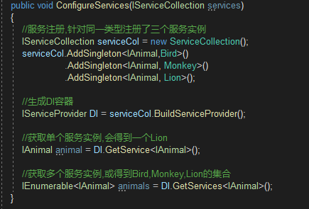

# Asp.NET Core DI框架概览
毫不夸张地说,整个ASP.NET Core框架是建立在一个依赖注入框架之上的,它在应用启动时构建请求处理管道的过程中,以及利用该管道处理每个请求过程中使用到的服务对象均来源于DI容器.该DI容器不仅为ASP.NET Core框架提供必要的服务,同时作为了应用的服务提供者,依赖注入已经成为了ASP.NET Core应用基本的编程模式.

## 服务的注册与消费
ASP.NET Core中的依赖注入框架中,我们添加的服务注册被保存到通过 __IServiceCollection__ 接口表示的集合之中,基于这个集合创建的DI容器体现为 __IServiceProvider__.

DI框架提供了生产实例的三种生命周期模式,分别为:
* __Singleton__:整个应用程序生命周期内单例
* __Scoped__:单次服务请求内的单例
* __Transient__:每次获取均会产生新的对象

DI框架注册服务时通常会使用三种方式,分别为:
* 指定注册非服务类型和实现类型.
* 指定一个现有的服务实例.
* 指定一个创建服务实例的委托对象.

当我们在进行服务注册时,可以为同一类型添加一个服务注册,也可以添加多个,实际上添加的所有服务注册都是有效的,在完成服务注册之后，我们调用IServiceCollection接口的扩展方法  **BuildServiceProvider**创建出代表DI容器的IServiceProvider对象,并利用它调用后者的**GetService<T>**方法来提供相应的服务实例,总时会返回一个服务实例,这里采用了"后来居上"的原则,即总是采用最近添加的服务注册来创建服务实例.如果我们调用另一个扩展方法**GetServices<T>**,它将利用返回所有服务注册提供的服务实例.如下所示的代码片段.

## 生命周期管理

