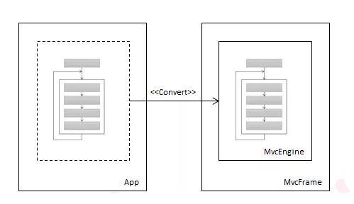
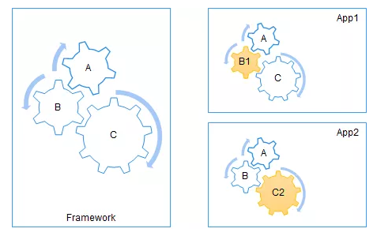

##  Asp.Net Core IOC模式

IoC全名为Inverse of Control,含义为"控制倒置",针对软件设计行业来说,IoC所谓的控制其实是"针对流程的控制".控制权原来在应用程序,应用程序可以根据自己的场景定义流程,而IoC原则主张流程的控制权转移到框架中,由框架来定义流程的步骤,我们可以通过下图来说明控制权的转移过程.

## 流程定制

我们采用IoC实现了流程控制从应用程序向框架自身的反转，但是这个被反转的仅仅是一个泛化的流程，任何一个具体的应用都可能需要对组成该流程的某些环节进行定制.作为一个Web框架，用户认证功能是必备的，但是框架自身不能限制于某一种或者几种固定的认证方式，应该通过扩展的方式让用户可以自由地定制任意的认证模式。

我们可以说得更加宽泛点。如下图所示我们将一个泛化的工作流程（A=>B=>C）被定义在框架之中，建立在该框架的两个应用需要对组成这个流程的某些环节进行定制。比如步骤A和C可以被App1重用，但是步骤B却需要被定制（B1），App2则重用步骤A和B，但是需要按照自己的方式处理步骤C。 

