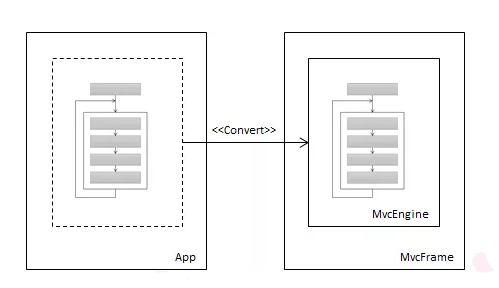
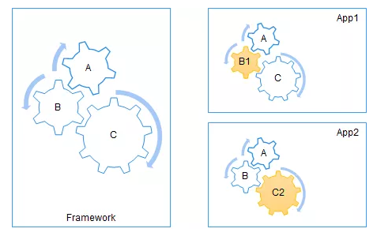

#  Asp.Net Core IOC模式
本系列文章来源于大内老A的博客,对博客内容进行了略微整理,方便自己以后查阅.

## IoC名词解释

IoC全名为Inverse of Control,含义为"控制倒置",针对软件设计行业来说,IoC所谓的控制其实是"针对流程的控制".控制权原来在应用程序,应用程序可以根据自己的场景定义流程,而IoC原则主张流程的控制权转移到框架中,由框架来定义流程的步骤,我们可以通过下图来说明控制权的转移过程.

## 流程定制

我们采用IoC实现了流程控制从应用程序向框架自身的反转，但是这个被反转的仅仅是一个泛化的流程，任何一个具体的应用都可能需要对组成该流程的某些环节进行定制.作为一个Web框架，用户认证功能是必备的，但是框架自身不能限制于某一种或者几种固定的认证方式，应该通过扩展的方式让用户可以自由地定制任意的认证模式。

我们可以说得更加宽泛点。如下图所示我们将一个泛化的工作流程（A=>B=>C）被定义在框架之中，建立在该框架的两个应用需要对组成这个流程的某些环节进行定制。比如步骤A和C可以被App1重用，但是步骤B却需要被定制（B1），App2则重用步骤A和B，但是需要按照自己的方式处理步骤C。 

## 总结

一方面IoC对框架的流程进行了封装,消费者只需要执行,框架利用引擎驱动整个流程的运转,应用程序无须关心该工作流程的细节,只需要启动引擎即可.另一方面,框架会提供一系列的扩展点,应用程序则通过定义扩展的方式实现对流程某个环节的定制,在引擎启动前,应用程序将所需的扩展注册到框架中,一旦引擎被正常启动,这些注册的扩展会自动参与到整个流程的执行过程中.这样就实现了框架对流程的高度复用和扩展.
